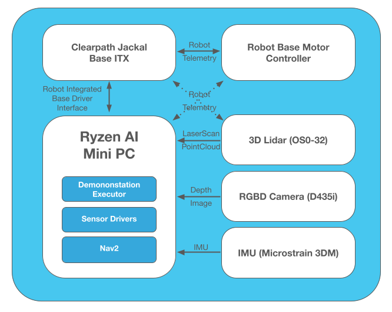
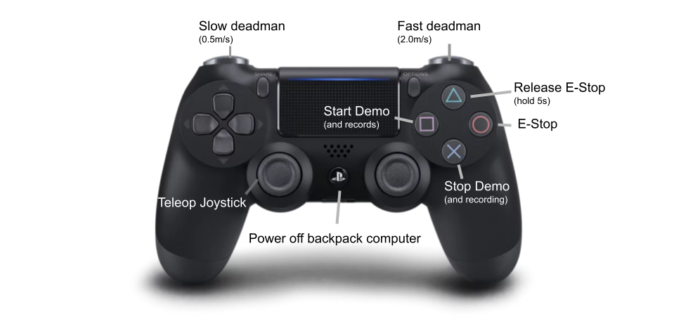

# Open Navigation - AMD Ryzen AI Demonstrations

This project has demonstrations and analysis using AMD's powerful Ryzen CPU, AI, and acceleration technologies with Nav2, ROS 2 Humble, and the open-source robotics community's technologies. These demononstrations show complete & tuned reference applications to perform **indoor 2D-based**, **urban 3D-based**, and **outdoor GPS-based** navigation. They use AMD's compute technologies and show that they are very well suited to robotics tasks and workloads, with plenty of compute time remaining for AI, business logic, application layers, and other computationally demanding tasks on top of advanced mobility and 3D perception. 

**⚠️ Need ROS 2, Nav2 help or support? Contact [Open Navigation](https://www.opennav.org/)! ⚠️**

These demonstrations orbit around the Honeybee reference platform, a [Clearpath Robotics Jackal](https://clearpathrobotics.com/jackal-small-unmanned-ground-vehicle/) outfitted with:
- AMD Ryzen Zen4 CPU using a [Miniforum UM790 Pro](https://store.minisforum.com/products/minisforum-um790-pro)
- [Ouster OS0-32](https://ouster.com/products/hardware/os0-lidar-sensor)
- [Realsense D435i](https://www.intelrealsense.com/depth-camera-d435i/) or [Orbecc Gemini 355](https://www.orbbec.com/products/stereo-vision-camera/gemini-335/)
- [Microstrain GX-25](https://www.microstrain.com/inertial-sensors/3dm-gx5-25)

[Demonstration 1: Outdoor GPS Navigation](./honeybee_demos/honeybee_demos/gps_patrol_demo.py) | [Demonstration 2: Urban 3D Navigation](./honeybee_demos/honeybee_demos/urban_navigation_demo.py) 
:-------------------------:|:-------------------------:
[](https://www.youtube.com/watch?v=255o4IS3rHg) |  [](https://www.youtube.com/watch?v=sL2GZdODUcE)
[**Demonstration 3: Long-Duration Indoor Navigation**](./honeybee_demos/honeybee_demos/indoor_long_duration_picking_demo.py) | **Glamour Shot** |
[](https://www.youtube.com/watch?v=evZ-GvswU4o) | 

**Click on the demo gifs to see the full videos on YouTube!**

This project contains a typical layout for a ROS-based mobile robot:
- `honeybee_description` contains the robot's description, meshes, and frame transformations (URDF)
- `honeybee_gazebo` contains the robot's simulation in modern Gazebo with the full sensor suite
- `honeybee_bringup` contains the bringup scripts to launch the robot's base and sensors on the physical hardware and/or simulation
- `honeybee_watchdogs` contains a set of watchdogs for hardware use, such as checking on the state of lifecycle activations and recording background datasets
- `honeybee_nav2` contains the navigation configurations for the various demonstrations
- `honeybee_demos` contains the demo scripts, launch files, and so forth to perform the applications. These would be notionally replaced by business logic for a refined, deployed application.
- `scripts` contain developer scripts used by Open Navigation to perform the demonstrations which have potential useful value to the community in getting started

Bonus: `docs` contains a number of developer guides for bootstrapping new computers for robots, network setup with ROS 2, setting up field experimental networks, how to visualize data remotely, make software run on startup, and so on.

- [First-Time Robot Computer Bootstrapping Guide](./docs/bootstrapping_robot_computer.md)
- [Setup Robot Automatic Software Launch Guide](./docs/setup_robot_automatic_bringup.md)
- [Multi-Computer Time Synchronization Guide](./docs/multi_computer_time_synchonization.md)
- [Offline Command, Control, and Visualization Guide](./docs/offline_command_and_control.md)
- [First-Time Mapping And Localization Guide](./docs/map_spaces.md)
- [Honeybee: Networking Setup Guide](./docs/honeybee_network_setup.md)
- [Honeybee: Disable CPR Services Guide](./docs/disable_clearpath_services.md)
- [Make Sure To Checkout Nav2's Great Guides Too!](https://docs.nav2.org/)

**[See the `honeybee_demos` package for detailed demonstration descriptions, videos, and datasets](./honeybee_demos)**

<video src="https://github.com/user-attachments/assets/9eef0d12-7b01-4654-be78-96281b261b64" controls autoplay loop></video>

## Launching Robot, Nav2, and Demos

The robot can be launched using `ros2 launch honeybee_bringup robot.launch.py` with the `use_simulation` launch configuration option to specify whether using the physical robot (default) or simulated robot (`use_simulation:=True`). This will bringup the full robot system and/or simulation with sensors.

The navigation system can be launched using `ros2 launch honeyee_nav2 nav2.launch.py` with a number of launch options, such as the localization type to use (3D, 2D, GPS, Local Navigation), simulation status, parameters, SLAM, and so forth.

The demonstrations can be launched using their respective launch files in `honeybee_demos` and utilize Nav2 configured for the particular application, the annotated autonomy scripts developed for the demonstrations, and appropriate watchdogs for data recording and system handling.

See launch files for a full set of launch configurations and options!

## Metrics and Analysis

While running the demonstrations, the resource utilization running the autonomy program, Nav2's autonomous navigation, 3D lidar and camera perception, and localization averaged to **10.85%** of the available CPU time on the 16-core, 60W [Ryzen AI](https://www.amd.com/en/products/processors/consumer/ryzen-ai.html)-powered computer. That's amazingly powerful leaving plenty of room for *many* application compute tasks, AI, and additional sensor processing pipelines. The entirety of the autonomy, perception, and localization systems can be handled only 2 AMD Zen 4 cores! This greatly unburdens systems and can run more, faster, and cheaper opening up new application possibilities.

While running outdoor GPS localization with the RPP or DWB controllers with non-persisting voxel grids, the average was **8.7%**, due to the lower compute demands. While when using more comparatively expensive and modern algorithms like MPPI, temporal voxel grids, and live SLAM, it rose to only **12.8%**. 

It can also build all of Nav2 in only **10 min, 15 sec**, as compared to 23 min, 3 sec minutes using an Intel i7-1365U on an X1 Carbon (Gen 11). 

Open Navigation is incredibly impressed with these results, using a computer with equivilient power utilization as an Nvidia Jetson in max power mode or an Intel NUC. This is a powerful machine for under $500! 

We're working next to tap into the Ryzen AI computer's built-in GPU and NPU for accelerating workloads and real-time AI (3D detection, semantic segmentation, GenAI, accelerating robotics algorithms). We'd highly recommend considering Ryzen AI-powered devices for future robotics products and projects for its power, pricepoint, and AI and hardware acceleration integrations, especially if you require more powerful x86 cores!

## Build 

This is straight forward to build and work with. Clone this repository into your workspace:

```
mkdir -p amd_ws/src
cd amd_ws/src
git clone git@github.com:open-navigation/opennav_amd_demos.git
```

Then, we need to pull in some dependencies that we cannot obtain from `rosdep`:

```
sudo apt install python3-vcstool  # if don't already have
vcs import . < opennav_amd_demonstrations/deps.repos
cd ouster-lidar/ouster-ros && git submodule update --init
cd ../../../

# For Orbecc 335 cameras, if used instead of Realsense D435
sudo bash src/orbbec/OrbbecSDK_ROS2/orbbec_camera/scripts/install_udev_rules.sh
sudo udevadm control --reload-rules && sudo udevadm trigger
```

Next, we need to obtain our dependencies that are available from `rosdep`:

```
sudo rosdep init  # if haven't done
rosdep update
rosdep install -r -y --from-paths src --ignore-src
```

Now, we can build using colcon:

```
colcon build
```

## Details on Robot

The robot has an internal network on the 192.168.131.* range.
- The robot's builtin PC is `192.168.131.1` with username `administrator` & password `clearpath` (`cpr-j100-0842` and `cpr-j100-0849`)
- The AMD backpack PC is `192.168.131.10` with username `administrator` & password `clearpath` (`hex` and `stinger`)
- The ouster lidar is `192.168.131.20` 

The Lidar is connected to the builtin PC due to limitations on the number of ethernet ports on the AMD computer (but could be easily remedied by an ethernet switch).



The controller has the custom layout shown in the diagram below. Various nodes across the system subscribe to the joystick topic to activate these features (i.e. teleop & estop launch with base bringup; poweroff and demo launches with demos).



The daemons that bringup the robot assumes that the workspace is located in `~/amd_ws` for sourcing to launch the resources. This can be easily changed by updating the services for the new workspace location in `honeybee_bringup/systemd` and [following the guide to setup robot bringup](./docs/setup_robot_automatic_bringup.md).

Data from the experiments are recorded and logged by the `nav2_watchdogs` in the `~/experiment_files` directory by default. These have a parameter `filepath` which can be set to use alternative file paths, however the scripts for copying and clearing old data use this filepath as well (but are trivial to update with a new path).

Note: each robot has a `colcon_ws` setup by Clearpath and is a hardcoded path with their auto-generation scripts. It is recommended to not touch this directory to allow for a complete rollback to on-delivery state should issues occur requiring Clearpath's intervention.

Subscribing to large topics over Wifi can hose the network and stall the programs. This can cause the robot to lose scheduling/TF transform timing, bluetooth controller to cutout, and so forth. It is recommended to use the robot in `ROS_LOCALHOST_ONLY` mode or not subscribe to topics off of the robot when not necessary or in current operations (i.e. close rviz so headless, run program in tmux session). This is good for setting up and debugging, but not in deployed applications -- at least with the default DDS settings in ROS 2 Humble. We also recommend using an isolated network for the robot so its not attempting to discover every device on a large corporate or building network (if not setting to localhost only).

Some configurations of Honeybee have the Realsense D435 and others have the Orbecc 355 cameras. If using Orbecc, set `USE_ORBECC=True` in your terminal before launching to bringup the Orbecc camera. This has been exported for you in the `~/.bashrc` and in the systemd bringup daemon for robots shipped from Open Navigation.
