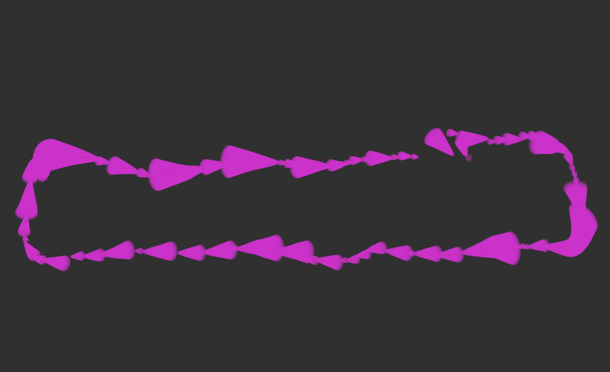

# Honeybee Demos 

This package contains a series of real-world applicable demos used to capture data for benchmarking the Ryzen AI compute hardware and Honeybee robot's performance. They are also great entry points for robotics applications to show how to setup a robot system, configure Nav2 for a variety of common advanced situations, and design a simple POC autonomy script for research, startups, or prototypers!

## Demo 1: High-Speed, Outdoor GPS Navigation

The goal of this demonstration is to show the AMD Ryzen AI compute in action running Nav2 at full speed - 2m/s - outdoors. This is performed on the Presidio main parade lawn in San Francisco, CA because it is a beautiful, generally empty (during weekdays), wide open space in which we can let robots loose at high speeds safely.

For this demonstration, we use the built-in non-RTK corrected GPS to localize the robot to show how to work with Nav2 outdoor with noisy GPS localization. For a refined application, we recommend using an RTK corrected GPS sensor to improve accuracy of localization and positioning tolerances. 

For more information, options, and a tutorial on GPS Navigation with Nav2, [see the Nav2 GPS Waypoint Navigation tutorial](https://docs.nav2.org/tutorials/docs/navigation2_with_gps.html).

We set the datum for `robot_localization` to be an arbitrarily selected position on the park in order to (1) ground the localization system near the origin for convenience and (2) such that this application can be repeated using the same waypoints grounded to a consistent coordinate system, as would be necessary for a deployed application. We use the `nav2_waypoint_follower` package to follow waypoints in the cartesian frame setup, though can also be done with direct GPS points as well in ROS 2 Iron and newer.

A few important notes on the configuration:
- The controller is configured to run at the robot's full speed, 2 m/s. This speed should be used by professionals under supervision if there is any chance of collision with other people or objects. These are dangerous speeds and require attention.
- The global costmap is set to a rolling, static size rather than being set by a map's size or static full field area. This is likely the best configuration for GPS Navigation when not using a map, just ensure that it is sufficiently large to encompass any two sequential viapoints. 
- The positioning tolerances are set comparatively high due to a relatively noisy non-RTK corrected GPS. When using a 3D lidar, this is sufficient given its resolution and range.

An example loop of the main parade ground with GPS data can be seen below:



This can be reproduced with the provided rosbag

```
ros2 bag play initial_gps_loop_rosbag.db3 --clock 20
ros2 launch honeybee_nav2 gps_localization.launch.py use_sim_time:=True
```

TODO drone video GIF -- full dataset

TODO metrics / marketing / etc

TODO data set available 


## Demo 2: Outdoor, Urban 3D Inspection


## Demo 3: Standard Indoor 

A few important notes on the configuration:
- We move slower in this demonstration - 0.5 m/s - due to being indoors around people and expensive equipment for safety
- We use the standard Nav2 localization and SLAM integrations - AMCL and SLAM Toolbox for positioning. We also use largely the standard defaults from Nav2 with the exception of robot specifics like footprint and controller tuning.
- Since we're navigating in a 2D environment, we can use PointCloud to Laserscan to ignore the ground points (which can be noisy on shiny surface). We still use the 3D nature of the lidar by considering a large band from the top of the robot (plus some margin) to a few cm off the ground. This uses the 3D lidar's entire useful data, but reduces computation and noisy points without need for explicit PointCloud filtering.

