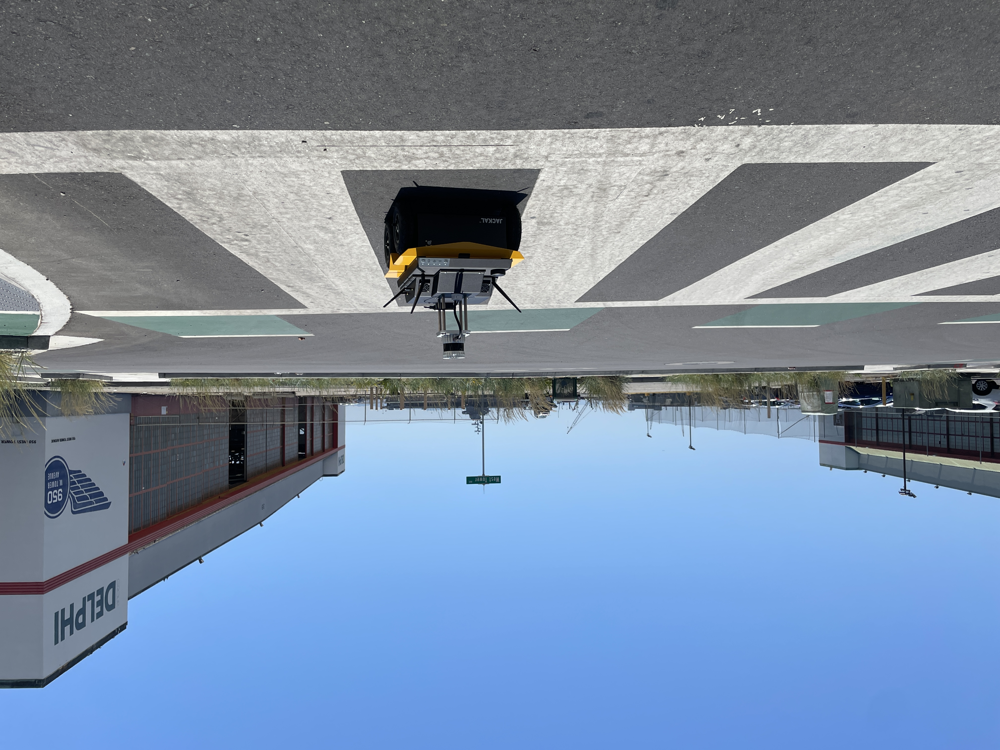
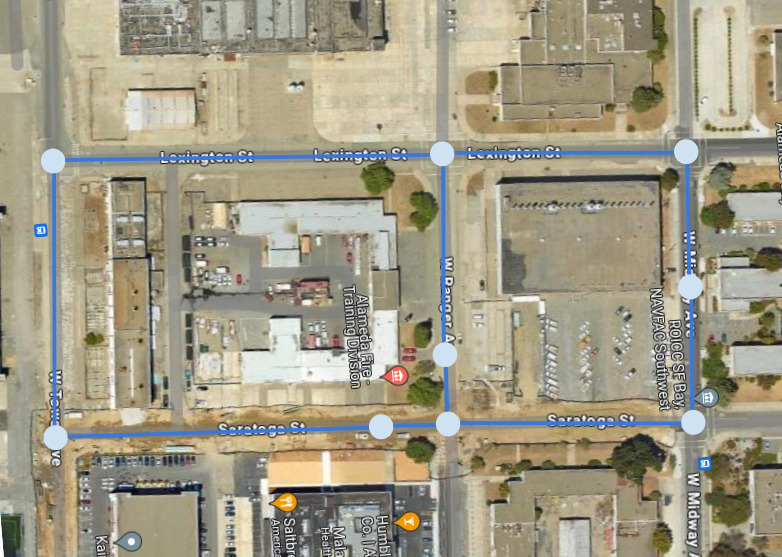
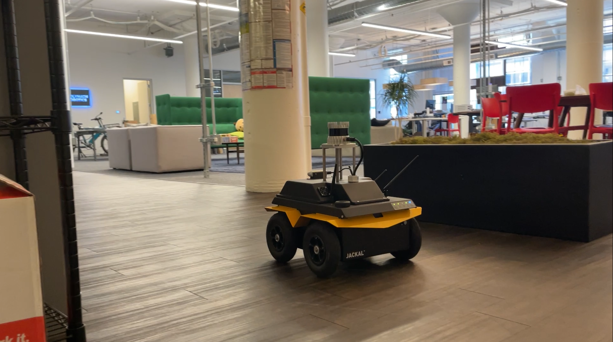
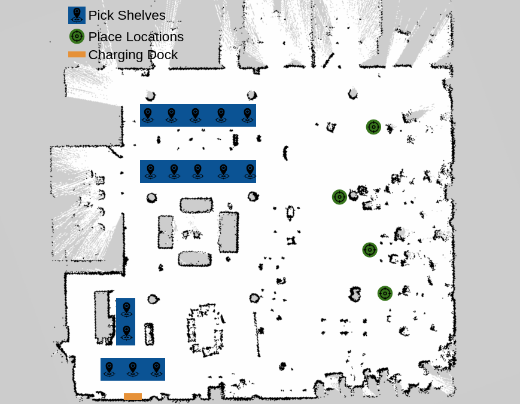

# Honeybee Demos 

This package contains a series of real-world applicable demos based on ROS 2 Humble. These demonstrations include Outdoor GPS Patrolling, Outdoor 3D Urban Navigation, and 2D Indoor Long-Duration Picking. We use an AMD Ryzen CPU (60W) with advanced NPU and AI Accelerator for these demonstrations, which are well up to the challenge of image and 3D lidar processing with much room left over for user applications and AI.

They are also great entry points for robotics applications to show how to setup a robot system, configure Nav2 for a variety of non-trivial situations, and design a proof of concept autonomy script for research, startups, or prototypers!

**⚠️ Need ROS 2, Nav2 help or support? Contact [Open Navigation](https://www.opennav.org/)! ⚠️**

## Demo 1: High-Speed, Outdoor GPS Navigation

The goal of this demonstration is to navigate outdoors in a non-planar environment running Nav2 at full speed - 2m/s. This is performed on the Presidio main parade lawn in San Francisco, CA because it is a beautiful, generally empty, wide open space in which the robots can be let loose at high speeds safely. This demonstration uses GPS to localize the robot while performing a patroling task in a loop and taking some measurements at each point of interest. There is no map what so ever.

[](https://www.youtube.com/watch?v=255o4IS3rHg)

**Note: Click on the image above to see the GPS Patrol demo in action on YouTube!**

For more information, options, and a tutorial on GPS Navigation with Nav2, [see the Nav2 GPS Waypoint Navigation tutorial](https://docs.nav2.org/tutorials/docs/navigation2_with_gps.html).

#### Technical Summary

Demo 1 uses `robot_localization` for GPS handling and sensor fusion. The datum for `robot_localization` is set to be an arbitrarily selected position on the park to ground the localization system near the origin for convenience and such that this application can be repeated using the same waypoints grounded to a consistent coordinate system, as would be necessary for a deployed application. The experiment was performed over multiple sessions and days.

It also leverages the `nav2_waypoint_follower` package to follow waypoints in the cartesian frame setup, though can also be done with direct GPS points as well in ROS 2 Iron and newer. It pause a few seconds at each waypoint to capture patrol data using the waypoint follower's task executor plugins.

A few important notes on this demonstration's configuration:
- Since we're navigating in non-flat, outdoor 3D spaces, we use a node to segment the ground out from the pointclouds for use in planning/control rather than directly feeding them in with the 3D terrain variations.
- The controller is configured to run at the robot's full speed, 2 m/s. This speed should be used by professionals under supervision if there is any chance of collision with other people or objects. These are dangerous speeds and require attention.
- The planner uses the Smac Planner Hybrid-A* so we can set a conservative maximum turning radius while operating at those speeds so the robot doesn't attempt to flip over due to its own centripetal force. It uses RPP to follow this path closely.
- The global costmap is set to a rolling, static size rather than being set by a map's size or static full field area. This is likely the best configuration for GPS Navigation when not using a map, just ensure that it is sufficiently large to encompass any two sequential viapoints. 
- This demonstration uses a BT that will not replan until its hit its goal or the controller fails to compute trajectories to minimize the impact of ~1-3m localization jumps on robot motion. This prevents 'drunken' behavior due to non-corrected GPS data's noise.
- The positioning tolerances are set comparatively high at 3m due to the noisy non-RTK corrected GPS. Additionally, the perception modules are configured as non-persistent so that the major jumps in localization don't cause series issues in planning for the world model - we use a 3D lidar, so we have good real-time 360 deg coverage. Both of these could be walked back when using RTK for typical uses of Nav2 with GPS localization. 

#### Dataset

The raw data from the robot during an approximately ~5 minute patrol loop including odometry, TF, commands, sensor data, and so forth can be [downloaded in this link.](https://drive.google.com/file/d/18JQoJMLNp_xd3dxEDEPyUfwqmlg3S48M/view?usp=sharing)


An example loop of the full length of the parade lawn with noisy GPS data can be seen below for illustration purposes. Navigation can still be leveraged effectively, however please be realistic about the limits on positional accuracies possible. GPS without RTK can obtain about 3-5m accuracy, but will jump:


This can be reproduced with the [provided rosbag of odometry, GPS data for state estimation](https://drive.google.com/file/d/1jTezqpsg-2C6iqoRO_IpXHklT5ccKhlT/view?usp=sharing).


```
ros2 bag play initial_gps_loop_rosbag.db3 --clock 20
ros2 launch honeybee_nav2 gps_localization.launch.py use_sim_time:=True
```

#### Notes on GPS

For this demonstration, a cheap built-in non-RTK corrected, single antenna GPS is used to localize the robot to show how to work with Nav2 outdoor with noisy GPS localization. For a refined application, an RTK corrected, dual antenna GPS sensor is recommended to improve accuracy of localization, positioning tolerances, and allow for persistence of perception data without major jumps. There are many affordable RTK GPS sensors on the market, [for example](https://holybro.com/products/h-rtk-unicore-um982).

With the GPS, its good to let the robot sit with the filter running for a little while before starting up the demo for the filter to converge to its location solidly before starting. I've noticed driving around a little bit to help with that process and converge the orientation from the IMU data.


## Demo 2: High-Speed, Urban 3D Navigation

The goal of this demonstration is to show the system in action running Nav2 using 3D SLAM and localization in an urban setting. This is performed on Alameda, an island in the San Francisco bay, because it has a large urban area formerly hosting a Naval Air Station which is perfect for experimentation without much through-traffic (and generally kind, understanding people). This demonstration maps and localizes the robot within a few city blocks on Alameda and routes the robot along the roadways using a navigation graph to go from one building to another representing an urban-navigation use-case.

[](https://www.youtube.com/watch?v=sL2GZdODUcE)

**Note: Click on the image above to see the Urban Navigation demo in action on YouTube!**

This is the experiment's location on Alameda & drone footage show the area for scale. The loop is approximately 1 km in length and takes the robot about 10 minutes to navigate around the outside bounding loop. The navigation graph routes through and/or visit a few intersections, a [very nice](https://humblesea.com/) brewery, Alameda's city hall, and a fire training station. For the purposes of the video demonstration,  street nodes are used as routes to get us to final destinations (city hall, brewery, station). The demonstration's autonomy script by default will randomly select a location to visit including intersections to provide more randomization.

 

#### Technical Summary

We use [lidarslam_ros2](https://github.com/rsasaki0109/lidarslam_ros2) for 3D SLAM and [lidar_localization_ros2](https://github.com/rsasaki0109/lidar_localization_ros2) SLAM using the Ouster 3D lidar. The OS-0 has a lower range than its OS-1 and OS-2 counterparts (in exchange for a wide vertical FOV), thus this demonstration is performed in an area where buildings and structures can be effectively seen within the limited ~30 meter effective range.

A few important notes on this demonstration's configuration:
- Since we're navigating in non-flat, urban 3D spaces, we use a node to segment the ground out from the pointclouds for use in planning/control rather than directly feeding them in with the 3D terrain variations. Some of the streets have large potholes, tall curbs, and small hills.
- In this demonstration, we use a navigation route graph of the streets and blocks for long-term planning in place of freespace planning on the roadways (i.e. like Google Maps or an AV might route). It computes the most time-optimal route on the roadway graph to get to a destination node. For a deployed application, you may marry this with the Nav2 freespace planner (like shown in the GPS demonstration above) to go the 'last meters' off the roads/sidewalks for the final positioning.
- Nav2's path smoother is used to smooth out the 90 degree turns in the graph to make better use of the roadway intersections and smooth, intuitive motion.
- The controller is configured to run at the robot's full speed, 2 m/s to operate on public roadways. This speed **and operating on public roads** should be used by professionals under careful supervision of the robot **and environment around you**. It is recommended to follow the robot **closely** and be ready to take over to pause in case through traffic appears. Be courteous and thoughtful in public spaces. We use DWB for this demonstration to round off the use of all 3 major controllers in the demos.
- The positioning tolerances are set to be 50cm due to the good accuracy of the 3D localization (opposed to uncorrected GPS).
- STVL is used now that localization is accurate to mark and raytrace data for managing a proper environmental model (with a temporal element).

An easy workflow to reproduce: 
1. Teleop robot to create map (or using autonomous navigation). Save map.
2. Using Rviz or another tool, find the location of key points of interest and intersections.
3. Update the graph to contain these intersections or points of interest based on the map's coordinate system.
4. Launch the demo and localize the robot in the 3D map, making sure that there is good correspondances between the map and sensor data before starting
5. Start the demo to go to random locations or modify to send it on a particular route!

#### Dataset

The raw data from a 3D mapping run around the entire 2 city block area can be [downloaded in this link.](https://drive.google.com/file/d/1rmdceuoLtxQcx_mjlNHPZ57Mk0Pg9Nqx/view?usp=sharing) Unfortunately, due to settings or limitations of the rosbags, some of the 3D lidar data does not appear to have been properly captured in some high-load moments of the experiment due to its length, but there are plenty of good segments.


#### Notes on 3D Mapping, Planning

For this demonstration, several 3D SLAM and localization solutions were analyzed. Unfortunately, relatively few were robust enough for use and the 3D SLAM selected was the best performing for the robot's OS-0 and its range sensor limitations. While 'good enough' success was found with this method, it is easy to swap in another solution that you prefer. 

Planning in Urban spaces can be done 2 primary ways (or mixed for long term & short term planning):
- Using freespace algorithms like the NavFn or Smac Planners which allow for planning in all non-occupied spaces constrained by some behavioral constraints like inflation, keepouts, semantics, or higher cost regions
- Using route algorithms that take in a pre-defined navigation graph of nodes and edges representing navigable routes

Thus, which way you desire depends on the application behavior in mind, the level of annotation possible, complexity of the environment or 3D map, and compute constraints on the platform to run AI-segmentation methods to determine navigability at run-time, and so on. It is common for outdoor applications to use both, for navigation on the route and 'last meters' or 'off-graph' navigation. We choose to show the demonstration with navigation graphs to provide additional, different technology demonstrations to the others shown here.

If you wish to use free-space planning, you may want to:
- Set the global costmap's size by the 3D map. While the 3D SLAM map is unlikely a 2D probablistic grid, you can generate one by taking a height-hand slice and creating a 2D map from it or segment the ground and generate the occupancy grid based on all mapped obstacles. There are many techniques for this available.
- Use semantic segmentations to identify navigable and non-navigable areas live during execution
- Use Smac Planner Hybrid-A* for obtaining high quality, feasible paths at the full speed of the robot performing full SE2 collision checking. 
- Use the behavior tree navigator to define your navigation logic for off-graph (and on-graph), and associated behavior transitions. 

## Demo 3: Long-Duration Indoor 2D Picking

The goal of this demonstration is to show the system in action running Nav2 using the standard 2D SLAM and localization in an indoor setting for long-duration applications involving auto-docking for charging to run over multiple days for continuous service. This was performed at Polymath Robotics in San Francisco by their generous offer to help! 

[](https://www.youtube.com/watch?v=evZ-GvswU4o)

**Note: Click on the image above to see the Long-Duration Picking demo in action on YouTube!**

This demonstration sets out a number of picking locations around a central shipping and receiving desk area and place locations at the end of engineering desk rows for delivery of goods. This demonstrations simulates picks at these locations and places them at the terminus of the desk rows. A docking location is marked by an Apriltag used by Nav2 Docking for charging between missions for continuous uptime. Note: the Clearpath Jackal does not come with a charging dock nor can it charge while powered on, so the charging is simulated using Nav2 Docking based on the Apriltag feature but doesn't actually charge. This is the same detection and docking pipeline you can use with an actual dock however, shown in `opennav_docking`'s examples.

The map and experiment layout can be seen below:



#### Technical Summary

A picking dispatcher is used to create random pick-and-place missions. In our autonomy program, we execute 3 pick-and-place missions and then go back to the charging dock in order to recharge until triggered again to execute by the dispatcher (in this case, our joystick). Within the program, there are commented out blocks for also enabling continuous pick-and-place mission execution until the battery is sufficiently low. After which, the robot automatically docks and will continue mission execution once the battery exceeds a minimum threshold to continue. Additionally, there's an option to run the pick-and-place missions on a fixed schedule (such as once an hour). This makes it easy to customize for either (a) cloud dispatched operations, (b) continuous operations, or (c) scheduled operations.

We made this running continuously for 90 minutes with 5 minute picking missions (18 complete, 3 pick-and-place & charge docking loops), which is roughly the battery life of the honeybee - since there is no charging dock.

A few important notes on the configuration:
- We move slower in this demonstration - 0.5 m/s - due to being indoors around people for safety in the office
- We use the standard Nav2 localization and SLAM integrations - AMCL and SLAM Toolbox for positioning. We also use largely the standard defaults from Nav2 with the exception of robot specifics like footprint and controller tuning.
- Since we're navigating in a 2D environment, we can use PointCloud to Laserscan to ignore the ground points (which can be noisy on shiny surface). We still use the 3D nature of the lidar by considering a large band from the top of the robot (plus some margin) to a few cm off the ground. This uses the 3D lidar's entire useful data, but reduces computation and noisy points without need for explicit PointCloud filtering or use of the ground segmentation node (less points of potential failure with glass / shiny floors).
- We use Hybrid-A* to consider the robot's non-circular footprint during planning
- We use MPPI in this demonstration for highly dynamic behavior in the dynamic human-filled environment, which considers Hybrid-A*'s feasible path's orientations for accurate directional tracking
- The collision monitor is used to prevent collision using raw sensor data by reducing the velocity commands proportionately to be at least 1.5 seconds from collision at all times.
- This demonstration uses Nav2's new Opennav Docking server to autodock the robot for charging. Since this platform does not come with a charging dock, this charging is simulated using a dock detection feature with no actual charging enabled
- The demonstration script shown inline how to trigger jobs based on (a) a cloud dispatcher or external trigger like a button, (b) based on the robot's battery being sufficiently energized to take on new missions after having charged when sufficiently low and, (c) based on a timer or cron job
- While not shown, it is easy to add in Keepout or Speed Restricted Zones to prevent navigation into certain areas or reduce speed in others - [see Nav2's tutorials](https://docs.nav2.org/tutorials/index.html).

Due to the nature of the location as a working office, no dataset is provided for this experiment.

An easy workflow to reproduce: 
1. Teleop robot to create map (or using autonomous navigation). Save map.
2. Using Rviz or another tool, find the location of key points of interest for picking and placing (like shelf and slot locations).
3. Update the pick and place dicts to contain the points of interest based on the map's coordinate system.
4. Setup a docking location and update it in the Nav2 yaml and script.
5. Launch the demo! It will automatically localize on the dock and start the random pick-and-place missions using the dispatcher!


