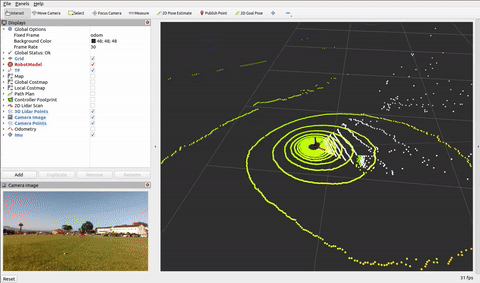

# Honeybee Demos 

This package contains a series of real-world applicable demos based on ROS 2 Humble used to capture data for benchmarking the Ryzen AI compute hardware and Honeybee robot's performance. They are also great entry points for robotics applications to show how to setup a robot system, configure Nav2 for a variety of common advanced situations, and design a simple POC autonomy script for research, startups, or prototypers!

## Demo 1: High-Speed, Outdoor GPS Navigation

The goal of this demonstration is to show the AMD Ryzen AI compute in action running Nav2 at full speed - 2m/s - outdoors. This is performed on the Presidio main parade lawn in San Francisco, CA because it is a beautiful, generally empty (during weekdays), wide open space in which we can let robots loose at high speeds safely.

[](https://www.youtube.com/watch?v=1G8xNuwNM8w)

Note: Click on the image above to see the GPS Patrol demo in action on YouTube! 

For more information, options, and a tutorial on GPS Navigation with Nav2, [see the Nav2 GPS Waypoint Navigation tutorial](https://docs.nav2.org/tutorials/docs/navigation2_with_gps.html).

### Technical Summary

We set the datum for `robot_localization` to be an arbitrarily selected position on the park in order to ground the localization system near the origin for convenience and such that this application can be repeated using the same waypoints grounded to a consistent coordinate system, as would be necessary for a deployed application. The experiment was performed over multiple days and this works well.

We use the `nav2_waypoint_follower` package to follow waypoints in the cartesian frame setup, though can also be done with direct GPS points as well in ROS 2 Iron and newer. We pause a few seconds at each waypoint to capture some patrol data.

A few important notes on this demonstration's configuration:
- Since we're navigating in non-flat, outdoor 3D spaces, we use a node to segment the ground out from the pointclouds for use in planning/control rather than directly feeding them in with the 3D terrain variations.
- The controller is configured to run at the robot's full speed, 2 m/s. This speed should be used by professionals under supervision if there is any chance of collision with other people or objects. These are dangerous speeds and require attention.
- The planner uses the Smac Planner Hybrid-A* so we can set a conservative maximum turning radius while operating at those speeds so the robot doesn't attempt to flip over due to its own centripetal force. It uses RPP to follow this path closely.
- The global costmap is set to a rolling, static size rather than being set by a map's size or static full field area. This is likely the best configuration for GPS Navigation when not using a map, just ensure that it is sufficiently large to encompass any two sequential viapoints. 
- This demonstration uses a BT that will not replan until its hit its goal or the controller fails to compute trajectories to minimize the impact of ~1-3m localization jumps on robot motion. This prevents 'drunken' behavior due to non-corrected GPS data's noise.
- The positioning tolerances are set comparatively high at 3m due to the noisy non-RTK corrected GPS. Additionally, the perception modules are configured as non-persistent so that the major jumps in localization don't cause series issues in planning for the world model - we use a 3D lidar, so we have good real-time 360 deg coverage. Both of these could be walked back when using RTK for typical uses of Nav2 with GPS localization. 

### Metrics

TODO metrics / marketing / etc - 'so much compute left over while navigating at 2m/s, 3d lidar processing, autonomy, etc. Super powerful machine, love the opportunity this presents in a 80W package'.

### Dataset

The raw data from the robot during an approximately ~5 minute patrol loop including odometry, TF, commands, sensor data, and so forth can be [downloaded in this link.](https://drive.google.com/file/d/110dgsD_lPXHl7Hn6XcIk0RsIgyCl47Ws/view?usp=sharing)



An example loop of the full length of the parade lawn with noisy GPS data can be seen below for illustration purposes. We can still navigate effectively, however we need to be realistic about the limits on positional accuracies possible. GPS without RTK can obtain about 3-5m accuracy, but will jump:


This can be reproduced with the [provided rosbag of odometry, GPS data for state estimation](https://drive.google.com/file/d/1sAm1_xIj3lyX5AkacrWUED3nsdiD7rKJ/view?usp=sharing).


```
ros2 bag play initial_gps_loop_rosbag.db3 --clock 20
ros2 launch honeybee_nav2 gps_localization.launch.py use_sim_time:=True
```

### Notes on GPS

For this demonstration, we use the cheap built-in non-RTK corrected, single antenna GPS to localize the robot to show how to work with Nav2 outdoor with noisy GPS localization. For a refined application, we recommend using an RTK corrected, dual antenna GPS sensor to improve accuracy of localization, positioning tolerances, and allow for persistence of perception data without major jumps. There are many affordable RTK GPS sensors on the market, [for example](https://holybro.com/products/h-rtk-unicore-um982).

With the GPS, its good to let the robot sit with the filter running for a little while before starting up the demo for the filter to converge to its location solidly before starting. I've noticed driving around a little bit to help with that process and converge the orientation from the IMU data.


## Demo 2: Outdoor, Urban 3D Inspection

TODO Remark on algorithms used and why


A few important notes on the configuration:
- Since we're navigating in non-flat, outdoor 3D spaces, we use a node to segment the ground out from the pointclouds for use in collision avoidance rather than directly feeding them in with the 3D terrain variations.
- Since this is using 3D SLAM, we need to convert the 3D map into a 2D occupancy grid-like thing for sizing the static layer in the global costmap for global planning in the map
- The positioning tolerances & perception modules are set back to normal since we don't have noisy GPS localization and now using 3D lidar SLAM & localization, still outdoors.


## Demo 3: Standard Indoor 

A few important notes on the configuration:
- We move slower in this demonstration - 0.5 m/s - due to being indoors around people for safety
- We use the standard Nav2 localization and SLAM integrations - AMCL and SLAM Toolbox for positioning. We also use largely the standard defaults from Nav2 with the exception of robot specifics like footprint and controller tuning.
- Since we're navigating in a 2D environment, we can use PointCloud to Laserscan to ignore the ground points (which can be noisy on shiny surface). We still use the 3D nature of the lidar by considering a large band from the top of the robot (plus some margin) to a few cm off the ground. This uses the 3D lidar's entire useful data, but reduces computation and noisy points without need for explicit PointCloud filtering or use of the ground segmentation node (less points of potential failure with glass / shiny floors).
- We treat this robot as a large point for global planning as an example with NavFn (oppposed to feasible planners for SE2 footprint checking in other demonstrations). This is a good working example for circular robots or computers with low compute. 
- We use MPPI in this demonstration for highly dynamic behavior in the dynamic human-filled environment
