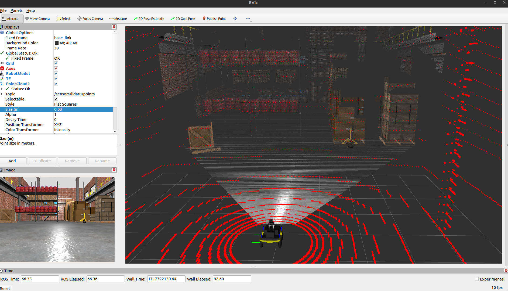

# Honeybee Gazebo

This contains a modern Gazebo simulation for the honeybee robot to launch instead of the hardware for desktop testing. It launches automatically with the bringup package with the command `use_simulator:=true` and mimicks the same topics provided by the hardware for a 1:1 replication.

To launch standalone without the bringup package, please use the command `use_joint_state_publisher:=true` to launch the robot's description that is otherwise handled in the bringup's `robot.launch.py` when launching the fully system. The system should be able to be visualized in the `base_link` frame (since default simulation without robot bringup will lack odometry system).

